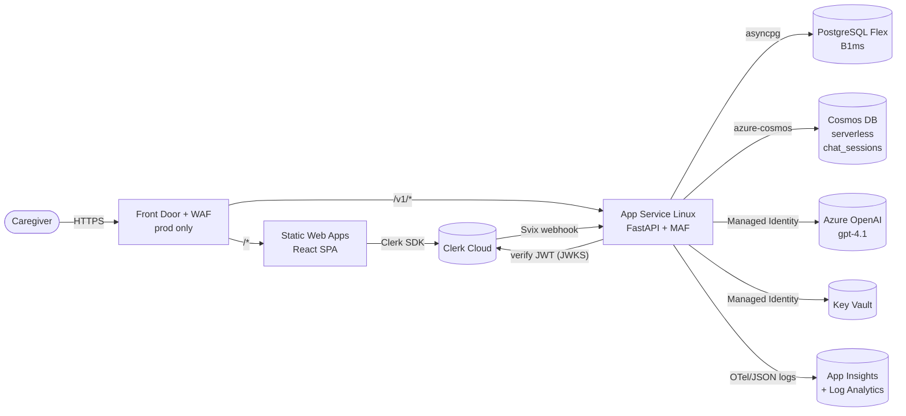

# MomDiary — Azure Deployment Plan

Status: draft v2 · Target cloud: Azure Commercial · Owner: platform/devops

End-to-end deployment of every component in this repository to Azure.
Locked stack: **App Service (Linux) + PostgreSQL Flexible Server B1ms +
Cosmos DB serverless (chat sessions only) + Azure OpenAI + Static Web Apps +
Clerk for auth.** Single resource group per environment.

---

## 1. Inventory of components

| # | Component | Source | Azure target |
|---|-----------|--------|--------------|
| 1 | Backend API (FastAPI + Microsoft Agent Framework) | [backend/](backend/) | **Azure App Service for Linux** (Python 3.12 built-in runtime) |
| 2 | Frontend SPA (React + Vite) | [frontend/](frontend/) | **Azure Static Web Apps** (Standard) |
| 3 | Relational database (users, babies, feeds, sleeps, poops, appointments) | [backend/alembic/](backend/alembic/) + SQLAlchemy models | **Azure Database for PostgreSQL Flexible Server — B1ms** |
| 4 | Chat session store (currently in-process dict, see `003-chat-session-store`) | [backend/src/momdiary/services/](backend/src/momdiary/services/) | **Azure Cosmos DB for NoSQL — serverless** (single container, TTL) |
| 5 | LLM | Called via `AzureOpenAIChatClient` + `DefaultAzureCredential` in [backend/src/momdiary/agents/diary_agent.py](backend/src/momdiary/agents/diary_agent.py) | **Azure OpenAI** (`gpt-4.1-mini` deployment) |
| 6 | Auth | Clerk JWT verify + Svix webhook | **Clerk Cloud** (third-party SaaS, unchanged) |
| 7 | Secrets | DB URL, Clerk keys, App Insights conn string | **Azure Key Vault** (RBAC) |
| 8 | Observability | `structlog` JSON + correlation IDs | **Application Insights + Log Analytics** |
| 9 | DNS / TLS / WAF (prod) | `app.momdiary.example`, `api.momdiary.example` | **Azure Front Door Standard + WAF** |

No Container Registry, no Container Apps, no VNet in this baseline — App
Service runs your code directly, Postgres uses Public Access + firewall + SSL,
Cosmos uses its public endpoint with key/AAD auth. Add Private Endpoints
later when compliance requires it.

---

## 2. Target architecture



---

## 3. Resource topology (one RG per environment)

| Resource | SKU (prod) | Name pattern |
|----------|------------|--------------|
| Resource group | n/a | `rg-momdiary-<env>` |
| Log Analytics workspace | PerGB2018 | `log-momdiary-<env>` |
| Application Insights | Workspace-based | `appi-momdiary-<env>` |
| Key Vault | Standard, RBAC, soft-delete + purge protection | `kv-momdiary-<env>` |
| App Service plan | **B1** (1 vCPU, 1.75 GB) dev / **P0v3** prod | `asp-momdiary-<env>` |
| App Service (backend) | Linux, Python 3.12 | `app-momdiary-api-<env>` |
| User-assigned Managed Identity | n/a | `id-momdiary-api-<env>` |
| Static Web App (frontend) | Standard | `swa-momdiary-<env>` |
| PostgreSQL Flexible Server | **Burstable B1ms** + 32 GB storage | `psql-momdiary-<env>` |
| PostgreSQL database | n/a | `momdiary` |
| Cosmos DB account (NoSQL API) | **Serverless** | `cosmos-momdiary-<env>` |
| Cosmos DB database | n/a | `momdiary` |
| Cosmos DB container | `chat_sessions`, PK `/userId`, TTL on | n/a |
| Azure OpenAI | S0 + `gpt-4.1` deployment | `aoai-momdiary-<env>` |
| Front Door + WAF (prod only) | Standard_AzureFrontDoor | `afd-momdiary-<env>` |

Naming follows [CAF abbreviations](https://learn.microsoft.com/azure/cloud-adoption-framework/ready/azure-best-practices/resource-abbreviations).

---

## 4. Pre-flight (one time per subscription)

1. Pick a region with **`gpt-4.1` quota AND Postgres Flex B1ms availability**.
   Good candidates: `eastus2`, `swedencentral`, `westus3`. Verify:
   `az cognitiveservices account list-skus --kind OpenAI -l <region>`.
2. Request Azure OpenAI access + quota for `gpt-4.1`.
3. Register providers: `Microsoft.Web`, `Microsoft.DBforPostgreSQL`,
   `Microsoft.DocumentDB`, `Microsoft.CognitiveServices`, `Microsoft.KeyVault`,
   `Microsoft.OperationalInsights`, `Microsoft.Insights`, `Microsoft.Cdn`.
4. Create a Clerk **production** instance; capture `CLERK_SECRET_KEY`,
   `CLERK_JWT_ISSUER`, optional `CLERK_JWT_AUDIENCE`,
   `CLERK_WEBHOOK_SECRET`. Set Clerk allowed origin to the future SPA URL.
5. Reserve DNS: `app.momdiary.example`, `api.momdiary.example` (prod only).

---

## 5. Backend code changes required before first deploy

These are the only non-trivial code edits. Everything else is config.

### 5.1 Add asyncpg and azure-cosmos to dependencies

In [backend/pyproject.toml](backend/pyproject.toml):

```toml
dependencies = [
  # ...existing...
  "asyncpg>=0.29",
  "azure-cosmos>=4.7",
  "azure-monitor-opentelemetry>=1.6",
]
```

`aiosqlite` stays as a dev/test dependency only.

### 5.2 Add a health endpoint

[backend/src/momdiary/main.py](backend/src/momdiary/main.py) currently has no
liveness route. App Service health checks need one:

```python
@app.get("/v1/healthz", include_in_schema=False)
async def healthz() -> dict[str, str]:
    return {"status": "ok"}
```

### 5.3 Swap the in-process session store for Cosmos

`003-chat-session-store` stores sessions in a Python dict — fine on a single
worker, broken the moment App Service runs 2+ workers or instances.
Implement a Cosmos-backed adapter in [backend/src/momdiary/services/](backend/src/momdiary/services/)
with the same interface. Cosmos doc shape:

```jsonc
{
  "id": "<sessionId>",         // partition key value lookup
  "userId": "<clerkUserId>",   // partition key (/userId)
  "babyId": "<babyId>",
  "turns": [ /* caregiver+assistant pairs, FIFO-trimmed */ ],
  "updatedAt": "2026-06-02T18:00:00Z",
  "ttl": 86400                  // seconds — Cosmos auto-deletes idle sessions
}
```

Native TTL replaces the manual cleanup loop. `MOMDIARY_SESSION_TTL_SECONDS`
in [backend/src/momdiary/config.py](backend/src/momdiary/config.py) becomes
the `ttl` written on each upsert.

### 5.4 Wire OpenTelemetry to App Insights

In [backend/src/momdiary/observability/logging.py](backend/src/momdiary/observability/logging.py),
when `APPLICATIONINSIGHTS_CONNECTION_STRING` is set, call
`configure_azure_monitor()` once at startup. Keep the existing `structlog`
JSON for stdout (App Service captures stdout into Log Analytics anyway).

### 5.5 Port Alembic to be dialect-agnostic

The 3 revisions in [backend/alembic/versions/](backend/alembic/versions/) were
written against SQLite. Review for SQLite-only patterns
(`batch_alter_table`, naive datetimes, untyped JSON) and adjust to plain
SQLAlchemy or branch on `op.get_bind().dialect.name`. Run `alembic upgrade head`
against a Postgres-in-Docker locally before deploying.

---

## 6. Provision Azure resources (manual first pass)

Pick your env (`dev` here). Run from a shell with `az login` complete.

```powershell
$env       = "dev"
$loc       = "eastus2"
$rg        = "rg-momdiary-$env"
$pgAdmin   = "pgadmin"
$pgPwd     = (New-Guid).Guid + "Aa1!"          # store in Key Vault immediately
$appName   = "app-momdiary-api-$env"
$pgName    = "psql-momdiary-$env"
$cosName   = "cosmos-momdiary-$env"
$kvName    = "kv-momdiary-$env"
$aoaiName  = "aoai-momdiary-$env"
$logName   = "log-momdiary-$env"
$aiName    = "appi-momdiary-$env"
$swaName   = "swa-momdiary-$env"
$uamiName  = "id-momdiary-api-$env"

az group create -n $rg -l $loc

# Log Analytics + App Insights
az monitor log-analytics workspace create -g $rg -n $logName -l $loc
$workspaceId = az monitor log-analytics workspace show -g $rg -n $logName --query id -o tsv
az monitor app-insights component create -g $rg -a $aiName -l $loc --workspace $workspaceId
$aiConn = az monitor app-insights component show -g $rg -a $aiName --query connectionString -o tsv

# Key Vault (RBAC mode)
az keyvault create -g $rg -n $kvName -l $loc --enable-rbac-authorization true `
  --enable-purge-protection true

# Managed Identity for the app
az identity create -g $rg -n $uamiName -l $loc
$uamiId   = az identity show -g $rg -n $uamiName --query id -o tsv
$uamiCid  = az identity show -g $rg -n $uamiName --query clientId -o tsv
$uamiPid  = az identity show -g $rg -n $uamiName --query principalId -o tsv

# PostgreSQL Flexible Server (B1ms, public access with firewall + SSL)
az postgres flexible-server create -g $rg -n $pgName -l $loc `
  --tier Burstable --sku-name Standard_B1ms `
  --version 16 --storage-size 32 `
  --admin-user $pgAdmin --admin-password $pgPwd `
  --public-access 0.0.0.0 `                          # open to Azure services; tighten below
  --database-name momdiary --yes

# Allow App Service outbound IPs only (after the app exists you can replace
# this with the outbound IP set; for now allow all Azure services)
az postgres flexible-server firewall-rule create -g $rg --name $pgName `
  --rule-name AllowAzureServices --start-ip-address 0.0.0.0 --end-ip-address 0.0.0.0

# Cosmos DB serverless, NoSQL API
az cosmosdb create -g $rg -n $cosName --kind GlobalDocumentDB `
  --capabilities EnableServerless --default-consistency-level Session `
  --locations regionName=$loc failoverPriority=0 isZoneRedundant=False
az cosmosdb sql database create -g $rg -a $cosName -n momdiary
az cosmosdb sql container create -g $rg -a $cosName -d momdiary -n chat_sessions `
  --partition-key-path "/userId" --ttl 86400

# Azure OpenAI + gpt-4.1 deployment
az cognitiveservices account create -g $rg -n $aoaiName -l $loc `
  --kind OpenAI --sku S0 --custom-domain $aoaiName --yes
az cognitiveservices account deployment create -g $rg -n $aoaiName `
  --deployment-name gpt-4.1 --model-name gpt-4.1 --model-version "2025-04-14" `
  --model-format OpenAI --sku-capacity 50 --sku-name Standard

# App Service plan + Linux web app (Python 3.12)
az appservice plan create -g $rg -n "asp-momdiary-$env" --is-linux --sku B1
az webapp create -g $rg -p "asp-momdiary-$env" -n $appName `
  --runtime "PYTHON:3.12"
az webapp identity assign -g $rg -n $appName --identities $uamiId

# Static Web App for frontend (Standard, GitHub source set later via the SWA Action)
az staticwebapp create -g $rg -n $swaName -l $loc --sku Standard
```

### 6.1 RBAC the UAMI must hold

```powershell
$aoaiId = az cognitiveservices account show -g $rg -n $aoaiName --query id -o tsv
$kvId   = az keyvault show -g $rg -n $kvName --query id -o tsv

# AOAI inference (no keys, ever)
az role assignment create --assignee-object-id $uamiPid --assignee-principal-type ServicePrincipal `
  --role "Cognitive Services OpenAI User" --scope $aoaiId

# Key Vault secrets
az role assignment create --assignee-object-id $uamiPid --assignee-principal-type ServicePrincipal `
  --role "Key Vault Secrets User" --scope $kvId
```

For Cosmos use either (a) keep the connection string in Key Vault, or (b)
assign the UAMI the **Cosmos DB Built-in Data Contributor** role:

```powershell
$cosId = az cosmosdb show -g $rg -n $cosName --query id -o tsv
az cosmosdb sql role assignment create -g $rg -a $cosName `
  --role-definition-id "00000000-0000-0000-0000-000000000002" `
  --principal-id $uamiPid --scope $cosId
```

### 6.2 Populate Key Vault

```powershell
$pgUrl = "postgresql+asyncpg://${pgAdmin}:${pgPwd}@${pgName}.postgres.database.azure.com:5432/momdiary?ssl=require"
az keyvault secret set --vault-name $kvName --name momdiary-db-url      --value "$pgUrl"
az keyvault secret set --vault-name $kvName --name clerk-secret-key     --value "<sk_live_...>"
az keyvault secret set --vault-name $kvName --name clerk-webhook-secret --value "<whsec_...>"
az keyvault secret set --vault-name $kvName --name appi-conn-string     --value "$aiConn"
$cosEndpoint = az cosmosdb show -g $rg -n $cosName --query documentEndpoint -o tsv
az keyvault secret set --vault-name $kvName --name cosmos-endpoint      --value "$cosEndpoint"
```

### 6.3 App Service configuration

```powershell
$kvUri = "https://$kvName.vault.azure.net"
az webapp config appsettings set -g $rg -n $appName --settings `
  "AZURE_CLIENT_ID=$uamiCid" `
  "AZURE_OPENAI_ENDPOINT=https://$aoaiName.openai.azure.com/" `
  "AZURE_OPENAI_DEPLOYMENT=gpt-4.1" `
  "AZURE_OPENAI_API_VERSION=2024-10-21" `
  "MOMDIARY_APP_ENV=$env" `
  "MOMDIARY_DEFAULT_TIMEZONE=America/Los_Angeles" `
  "MOMDIARY_ALLOWED_ORIGINS=https://$swaName.azurestaticapps.net" `
  "CLERK_JWT_ISSUER=https://clerk.momdiary.example" `
  "MOMDIARY_DB_URL=@Microsoft.KeyVault(SecretUri=$kvUri/secrets/momdiary-db-url/)" `
  "CLERK_SECRET_KEY=@Microsoft.KeyVault(SecretUri=$kvUri/secrets/clerk-secret-key/)" `
  "CLERK_WEBHOOK_SECRET=@Microsoft.KeyVault(SecretUri=$kvUri/secrets/clerk-webhook-secret/)" `
  "APPLICATIONINSIGHTS_CONNECTION_STRING=@Microsoft.KeyVault(SecretUri=$kvUri/secrets/appi-conn-string/)" `
  "MOMDIARY_COSMOS_ENDPOINT=@Microsoft.KeyVault(SecretUri=$kvUri/secrets/cosmos-endpoint/)" `
  "MOMDIARY_COSMOS_DB=momdiary" `
  "MOMDIARY_COSMOS_CONTAINER=chat_sessions" `
  "SCM_DO_BUILD_DURING_DEPLOYMENT=true"

# Startup command — uvicorn on App Service's $PORT (defaults to 8000)
az webapp config set -g $rg -n $appName --startup-file `
  "gunicorn -k uvicorn.workers.UvicornWorker -w 2 --bind=0.0.0.0:8000 --chdir src momdiary.main:app"

# Health check
az webapp config set -g $rg -n $appName --generic-configurations '{"healthCheckPath":"/v1/healthz"}'

# HTTPS only + min TLS
az webapp update -g $rg -n $appName --https-only true
az webapp config set -g $rg -n $appName --min-tls-version 1.2
```

### 6.4 Lock down Postgres to App Service outbound IPs

```powershell
$ips = az webapp show -g $rg -n $appName --query possibleOutboundIpAddresses -o tsv
# Remove the wide-open rule, then add each IP:
az postgres flexible-server firewall-rule delete -g $rg --name $pgName --rule-name AllowAzureServices --yes
$ips.Split(",") | ForEach-Object {
  az postgres flexible-server firewall-rule create -g $rg --name $pgName `
    --rule-name "app-$_" --start-ip-address $_ --end-ip-address $_
}
```

---

## 7. Deploy the backend code

Two viable paths. Pick **A** for simplicity, **B** if you containerise later.

### Option A — Zip deploy from CI (recommended for first deploy)

```powershell
cd backend
Compress-Archive -Path src,alembic,alembic.ini,pyproject.toml -DestinationPath app.zip -Force
az webapp deploy -g $rg -n $appName --src-path app.zip --type zip
```

App Service's Oryx builder installs from `pyproject.toml` automatically when
`SCM_DO_BUILD_DURING_DEPLOYMENT=true`.

### Option B — Container path (later, when ACR is added)

Add a `Dockerfile`, push to ACR, point App Service at the image.

### 7.1 Run migrations once per release

```powershell
az webapp ssh -g $rg -n $appName
# inside the SSH session:
cd /home/site/wwwroot
alembic upgrade head
```

Do **not** run migrations from app startup — multi-worker startup will race.

---

## 8. Deploy the frontend

1. In the Azure portal, on the SWA, copy the deployment token.
2. Add a GitHub Actions workflow at `.github/workflows/frontend.yml` using
   `Azure/static-web-apps-deploy@v1`. App location `frontend/`,
   output `dist`, build `npm run build`.
3. Build-time env vars on the SWA:
   - `VITE_API_BASE_URL=https://<appName>.azurewebsites.net` (dev)
     or `https://api.momdiary.example` (prod, via Front Door)
   - `VITE_CLERK_PUBLISHABLE_KEY=pk_live_...`
4. Add [frontend/staticwebapp.config.json](frontend/staticwebapp.config.json)
   with SPA fallback + security headers (HSTS, nosniff, Referrer-Policy, CSP
   allow-listing Clerk and the API origin).

---

## 9. Front Door (prod only)

Skip for `dev`. For `prod`:

- AFD profile with two origin groups: `frontend` → SWA hostname,
  `backend` → App Service hostname.
- Routes: `app.momdiary.example/*` → frontend, `api.momdiary.example/*` →
  backend.
- WAF (Default ruleset + Bot Manager) in **Prevention** mode.
- Lock the App Service to AFD-only:
  ```powershell
  az webapp config access-restriction add -g $rg -n $appName `
    --rule-name AllowAFD --action Allow --priority 100 `
    --service-tag AzureFrontDoor.Backend `
    --http-header x-azure-fdid=<your-AFD-id>
  ```
- With a single apex per env, set
  `MOMDIARY_ALLOWED_ORIGINS=https://app.momdiary.example`.
- Clerk webhook target becomes `https://api.momdiary.example/v1/webhooks/clerk`.

---

## 10. Observability

- `azure-monitor-opentelemetry` auto-instruments FastAPI, asyncpg, and
  `httpx` calls to AOAI. Correlation IDs from `CorrelationIdMiddleware`
  become the OTel `operation_Id`.
- App Service stdout → Log Analytics automatically via diagnostic settings:
  ```powershell
  az monitor diagnostic-settings create --name "to-law" `
    --resource (az webapp show -g $rg -n $appName --query id -o tsv) `
    --workspace $workspaceId `
    --logs '[{"category":"AppServiceConsoleLogs","enabled":true},
              {"category":"AppServiceHTTPLogs","enabled":true}]'
  ```
  Repeat for Postgres, Cosmos, AOAI, Key Vault.
- Alerts to create (in App Insights):
  - Failed request rate > 1% over 5 min
  - `/v1/entries` p95 latency > 3 s
  - AOAI 429 / 5xx > 0 over 5 min
  - Postgres CPU > 80% sustained 10 min
  - Cosmos 429 rate > 0 (means you've hit serverless throttling)

---

## 11. Cost estimate (East US 2, list price)

| Resource | Dev $/mo | Prod $/mo |
|----------|---------:|----------:|
| App Service plan (B1 dev, P0v3 prod) | $13 | $54 |
| PostgreSQL Flex **B1ms** + 32 GB storage + LRS backup | $16 | $16 (or B2s $28 if you grow) |
| Cosmos DB serverless (sessions only) | $1–5 | $5–20 |
| Static Web Apps Standard | $9 | $9 |
| Azure OpenAI gpt-4.1 | usage | usage |
| Key Vault | <$1 | <$1 |
| Log Analytics + App Insights | $5–20 | $20–100 |
| Front Door Standard | — | $35 + egress |
| **Floor (no AOAI usage)** | **~$45/mo** | **~$145/mo** |

`B1ms` Postgres is sized for **≤100 concurrent caregivers / low write
traffic**. Move to `B2s` ($28/mo) or `D2ds_v5` ($113/mo) when CPU credits
exhaust or you exceed ~50 connections.

### Dev cost-cutting

Stop Postgres outside work hours (saves ~60%):

```powershell
# Stop nightly at 7pm local
az postgres flexible-server stop -g $rg --name $pgName
# Start at 8am
az postgres flexible-server start -g $rg --name $pgName
```

Wire to a Logic App schedule or a GitHub Actions cron — brings dev DB to
~$5–6/mo.

---

## 12. Environments and promotion

| Env | App plan | Postgres | Cosmos | Front Door | DNS |
|-----|----------|----------|--------|-----------|-----|
| `dev` | B1 | B1ms (scheduled stop) | serverless | no | `app-…-dev.azurewebsites.net` |
| `stg` | B2 | B1ms (always on) | serverless | optional | `stg.app.momdiary.example` |
| `prod` | P0v3 (zone-redundant) | B2s + HA *or* D2ds_v5 + HA | serverless | yes | `app.momdiary.example` |

Promote by re-running the same provisioning script with `$env="stg"` /
`$env="prod"` and re-deploying the same git SHA.

---

## 13. Security checklist

- [ ] App Service `https-only=true`, `minTlsVersion=1.2`
- [ ] Managed identity used for AOAI, Cosmos (data plane), Key Vault — no
      keys in env vars
- [ ] Postgres `ssl=require` in connection string
- [ ] Postgres firewall = App Service outbound IPs only (not 0.0.0.0)
- [ ] Key Vault RBAC, soft-delete + purge protection
- [ ] Clerk webhook signature verified by `svix` in
      [backend/src/momdiary/api/webhooks.py](backend/src/momdiary/api/webhooks.py)
- [ ] CSP in `staticwebapp.config.json` allow-lists only Clerk + API origin
- [ ] WAF in Prevention mode (prod)
- [ ] Rate limit on `/v1/entries` (10 req/min/IP) via AFD rule (prod)

---

## 14. Disaster recovery

- **Postgres**: 7-day PITR by default. Bump prod to 35-day + geo-redundant
  backups. Document the `az postgres flexible-server restore` runbook.
- **Cosmos**: serverless gets periodic backups every 4h, restorable for 8h
  by default. Bump to "continuous backup" for prod (~$$$ per GB) — or accept
  that sessions are ephemeral and don't need restore.
- **App Service**: source-controlled; redeploy from a known git SHA. Keep
  the last 5 zip artefacts in a Storage container.
- Run a **quarterly DR drill** in a sandbox RG.

---

## 15. CI/CD (next step after manual cutover works)

Two GitHub Actions workflows, both using **OIDC** (no long-lived secrets):

- `.github/workflows/backend.yml` — on push to `main` touching `backend/**`:
  ruff + mypy + pytest (must keep ≥80% coverage gate from
  [backend/pyproject.toml](backend/pyproject.toml)), then
  `az webapp deploy --type zip`, then SSH-run `alembic upgrade head`.
- `.github/workflows/frontend.yml` — on push and PR: lint + typecheck +
  vitest + `Azure/static-web-apps-deploy@v1`.

When CI is solid, convert the provisioning script in §6 to Bicep / `azd up`.

---

## 16. Cutover checklist (one-time per env)

- [ ] Provision per §6
- [ ] Code changes per §5 merged
- [ ] `alembic upgrade head` succeeds against Postgres
- [ ] First zip deploy returns 200 on `/v1/healthz`
- [ ] Smoke test [backend/smoke_006.py](backend/smoke_006.py) green against
      the deployed URL
- [ ] Frontend deployed, login through Clerk works end-to-end
- [ ] Clerk webhook delivered + verified (check App Insights for the
      `webhook.clerk.verified` log)
- [ ] App Insights receiving traces, alerts armed
- [ ] DNS flipped (prod), monitor 24h
