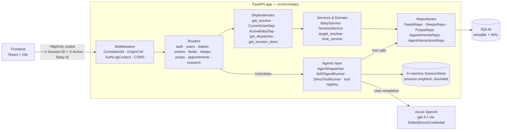
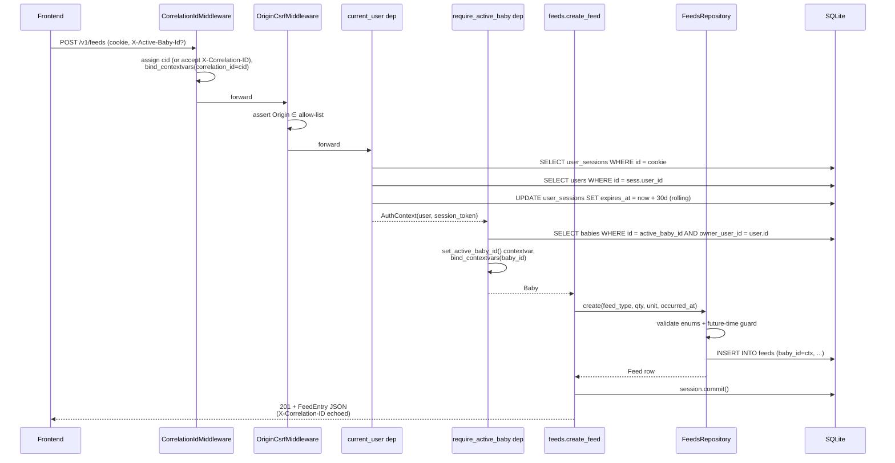
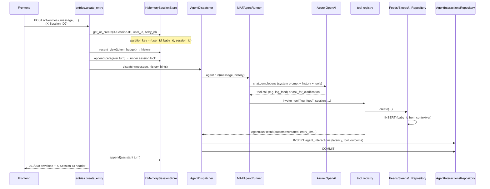

# MomDiary Backend — Design & Code Workflow

> FastAPI + SQLAlchemy 2.x (async, aiosqlite) + Microsoft Agent Framework (MAF) backend for the MomDiary baby tracker. This document explains the layered architecture, the lifecycle of a request, and the design of every HTTP API exposed under `/v1/*`.
>
> **Audience**: contributors who need to extend or operate the backend. Prior knowledge of FastAPI dependencies, async SQLAlchemy, and OpenAI-style tool-calling agents is assumed.

---

## 1. Quick start

```powershell
cd backend
python -m venv .venv ; .venv\Scripts\Activate.ps1
pip install -e ".[dev]"
copy .env.example .env                                 # then fill AZURE_OPENAI_ENDPOINT
$env:PYTHONPATH = "src"
alembic upgrade head                                   # creates momdiary.db
uvicorn momdiary.main:app --reload --port 8000
```

Tests (test-first per Constitution Principle II):

```powershell
$env:PYTHONPATH = "src"
python -m pytest -q --no-cov --ignore=tests/benchmarks
```

Auth uses Microsoft Entra ID (`DefaultAzureCredential`) for Azure OpenAI — sign in with `az login` locally; in Azure use a managed identity. **No API keys are ever read or stored** (Principle IV).

---

## 2. High-level architecture



### Layering rules

| Layer | Module(s) | Responsibility | May depend on |
|---|---|---|---|
| HTTP | `momdiary.api.*` | URL routing, Pydantic validation, status codes, response envelopes | Services, Agents, Repositories (only via Deps), Schemas |
| Auth/middleware | `momdiary.auth.*`, `momdiary.observability.middleware` | Cookies, sessions, CSRF, correlation-id, structlog binding | DB engine, Config |
| Agents | `momdiary.agents.*` | LLM orchestration, tool dispatch, audit logging, conversation memory | Repositories, Services, MAF SDK |
| Services | `momdiary.services.*`, `momdiary.babies.service` | Pure domain logic (target resolution, time math, baby CRUD) | Repositories, ORM |
| Repositories | `momdiary.db.repositories.*` | SQL only — every method is a single transaction unit | ORM, time_service |
| ORM/Schemas | `momdiary.models.*`, `momdiary.schemas.*` | Table definitions + Pydantic DTOs | (leaves) |

> **Rule**: no layer may import from above it. The agent tool functions are the only place where business rules and the LLM coexist; everything else stays HTTP-only or DB-only.

---

## 3. Request lifecycle (end-to-end)

Three representative flows show how every layer cooperates.

### 3a. `POST /v1/feeds` (deterministic quick-log)



### 3b. `POST /v1/entries` (agent-routed write)



### 3c. `PUT /v1/entries` (direct update with idempotency)

If `(entry_id, entry_type)` are supplied, the router bypasses the LLM and calls a `_DirectToolRunner` that maps to `update_feed` / `update_sleep` / `update_poop` / `update_appointment` directly. The repository returns an `unchanged: bool` flag so the second of two identical PUTs returns a byte-identical body (FR-015, validated by `test_repeated_put_byte_identical`). If only `message` is supplied the flow is identical to 3b.

---

## 4. Module map

```
backend/src/momdiary/
├── main.py                     # FastAPI factory + router registration
├── config.py                   # Pydantic Settings (env-driven)
├── api/                        # HTTP layer (one router per resource)
│   ├── auth.py                 # /v1/auth/{register,login,logout,me}
│   ├── users.py                # /v1/users/me, /v1/users/me/active-baby
│   ├── babies.py               # /v1/babies CRUD
│   ├── entries.py              # /v1/entries (POST agent-write, PUT update/delete)
│   ├── feeds.py                # /v1/feeds CRUD + GET by date
│   ├── sleeps.py               # /v1/sleeps  ″
│   ├── poops.py                # /v1/poops   ″
│   ├── appointments.py         # /v1/appointments + notes
│   ├── research.py             # /v1/research  (stub, returns canned citations)
│   └── dependencies.py         # build_response_envelope, get_dispatcher, get_session_store
├── agents/                     # MAF orchestration
│   ├── diary_agent.py          # MAF ChatAgent builder + system prompt
│   ├── maf_runner.py           # Adapts MAF Agent.run(...) → AgentRunResult
│   ├── dispatcher.py           # Audits + measures every agent run
│   ├── session_store.py        # In-memory bounded chat history (FR-009..FR-013)
│   └── tools/                  # log_*/update_*/delete_*/list_* + registry
├── auth/
│   ├── dependencies.py         # CurrentUserDep, ActiveBabyDep, cookie/header parsing
│   ├── sessions.py             # SessionService (rolling 30-day token CRUD)
│   ├── hasher.py               # Argon2id password hashing (constant-time dummy)
│   ├── middleware.py           # OriginCsrfMiddleware, AuthLogContextMiddleware
│   └── context.py              # ContextVar for active_baby_id (repo-side scoping)
├── babies/
│   └── service.py              # BabyService: create/list/update/soft_delete/set_active
├── db/
│   ├── engine.py               # Async engine + sessionmaker + SQLite PRAGMAs (WAL)
│   └── repositories/           # One repo per table + agent_interactions audit log
├── models/
│   ├── orm.py                  # SQLAlchemy DeclarativeBase tables
│   └── schemas.py              # Pydantic DTOs mirroring openapi.yaml
├── observability/
│   ├── logging.py              # structlog JSON renderer + MAF warning suppression
│   └── middleware.py           # CorrelationIdMiddleware (X-Correlation-ID)
├── schemas/                    # Feature-006 auth & profile DTOs (split from models/)
│   ├── auth.py
│   ├── babies.py
│   └── users.py
└── services/
    ├── target_resolver.py      # Resolve hinted (entry_id, entry_type) → row exists?
    └── time_service.py         # tz-aware date windows, ISO parsing
```

Alembic migrations live in `backend/alembic/versions/`. There are exactly two:

| Revision | Title | Purpose |
|---|---|---|
| `0001_initial` | Diary tables | `feeds`, `sleeps`, `poops`, `appointments`, `appointment_notes`, `agent_interactions` |
| `0002_users_babies` | Caregivers + baby scoping | Adds `users`, `user_sessions`, `babies`; backfills `baby_id NOT NULL` on every diary table and the COLLATE NOCASE unique index on `users.email` |

---

## 5. Cross-cutting design choices

### 5.1 Authentication & sessions

- **Argon2id** password hashing via `argon2-cffi` (`auth/hasher.py`). Login + register both run `hasher.dummy_verify()` on the miss path to keep response time constant (prevents email-enumeration timing oracle).
- **Opaque rolling cookie**: `momdiary_session` HttpOnly cookie holds a 256-bit `secrets.token_urlsafe(32)` value that is the PK of `user_sessions`. Every authenticated request slides `expires_at = now + 30 days` (`SessionService.touch`).
- **CSRF defence**: `OriginCsrfMiddleware` rejects every state-changing request whose `Origin`/`Referer` is not in `MOMDIARY_ALLOWED_ORIGINS`. Combined with `SameSite=Lax` cookies this is sufficient for v1 (no double-submit token).
- **Tenant scoping**: `require_active_baby` resolves the active baby from either `X-Active-Baby-Id` (per-request override for the "switcher" UI) or `users.active_baby_id`. It stores the id on a `ContextVar` so every `*Repository.create()` / `list_by_date()` automatically scopes to it without needing to thread the id through every signature.
- **Cross-tenant safety**: Both `BabyService.get_owned` and `require_active_baby` always filter by `owner_user_id == user.id`. Negative paths return `404 not_found` (not 403) so we never leak whether a row exists in another tenant (FR-016).

### 5.2 Database

- SQLite via `sqlite+aiosqlite`. On every connection we issue `PRAGMA journal_mode=WAL`, `synchronous=NORMAL`, `busy_timeout=10000`, `foreign_keys=ON` (see `db/engine.py::_install_sqlite_pragmas`). This eliminates the classic "database is locked" failure under concurrent session sliding.
- Timestamps are stored as ISO-8601 strings with second precision (`_utcnow_iso()`). All queries that compare timestamps build the comparand the same way (`time_service.to_iso`).
- Soft delete is universal: every diary row has `deleted_at` (nullable). Lists filter `deleted_at IS NULL`; soft-deleted rows are invisible to the agent (its `list_*` tools also filter).
- `users.active_baby_id` has `ON DELETE SET NULL` + `use_alter=True` to break the circular FK between `users` and `babies` at schema-create time.

### 5.3 Observability

- **Structured JSON logs** via `structlog`. `configure_logging()` runs once during app lifespan startup and pipes to stdout.
- **Correlation-id**: every request gets one — either the inbound `X-Correlation-ID` or a fresh uuid4. The id is set on a contextvar AND bound into structlog's contextvars so every downstream log line carries it. Echoed back as a response header.
- **Auth log enrichment**: once `current_user`/`require_active_baby` resolve, they call `structlog.contextvars.bind_contextvars(user_id=..., baby_id=...)`, so every subsequent log line in that request carries those too (FR-022).
- **Agent audit log**: every `AgentDispatcher.dispatch()` writes an `agent_interactions` row with `inbound_message`, `selected_tool`, `entry_type/id`, `outcome`, `latency_ms`, `model_latency_ms`. This is the durable record for debugging and the source of training data for prompt regression.

### 5.4 Configuration

All config flows through [`config.py`](src/momdiary/config.py) (a Pydantic `BaseSettings`). The env file is `backend/.env`; tunables documented in `.env.example`. The settings object is cached with `@lru_cache(maxsize=1)`.

| Group | Variable | Default | Purpose |
|---|---|---|---|
| Azure | `AZURE_OPENAI_ENDPOINT`, `AZURE_OPENAI_DEPLOYMENT`, `AZURE_OPENAI_API_VERSION` | — / `gpt-4.1` / `2024-10-21` | Foundry endpoint for MAF |
| Core | `MOMDIARY_DB_URL` | `sqlite+aiosqlite:///./momdiary.db` | DB connection string |
| Core | `MOMDIARY_DEFAULT_TIMEZONE` | `America/Los_Angeles` | Used by `date_window_in_tz` for all "today" queries |
| Core | `MOMDIARY_APP_ENV` | `dev` | `prod` enables strict CSRF (Origin required) |
| Core | `MOMDIARY_ALLOWED_ORIGINS` | `http://localhost:5173` | CORS + CSRF allow-list |
| Sessions (chat) | `MOMDIARY_SESSION_TTL_SECONDS` | `86400` | Idle TTL per chat session (FR-010) |
| Sessions (chat) | `MOMDIARY_SESSION_MAX_TURNS` | `50` | FIFO turn cap (FR-009) |
| Sessions (chat) | `MOMDIARY_SESSION_MAX_SESSIONS` | `100` | Global LRU cap (FR-011) |
| Sessions (chat) | `MOMDIARY_SESSION_MESSAGE_MAX_BYTES` | `4096` | Per-message byte cap (FR-012) |
| Sessions (chat) | `MOMDIARY_SESSION_PROMPT_TOKEN_BUDGET` | `12000` | Token-aware trim on read (FR-013) |
| Sessions (auth) | `MOMDIARY_SESSION_COOKIE_NAME` | `momdiary_session` | Cookie name |
| Sessions (auth) | `MOMDIARY_SESSION_COOKIE_TTL_DAYS` | `30` | Rolling cookie TTL |
| Sessions (auth) | `MOMDIARY_SESSION_COOKIE_SECURE` | `false` | Set `true` over HTTPS |
| Sessions (auth) | `MOMDIARY_SESSION_COOKIE_SAMESITE` | `lax` | `strict` / `lax` / `none` |

### 5.5 Error envelope

All errors return the same shape:

```json
{
  "error": "validation_error|not_found|unauthenticated|conflict|csrf_blocked|http_error|...",
  "message": "Human-readable message.",
  "correlation_id": "uuid",
  "session_id": "uuid (only on /v1/entries)"
}
```

This is enforced by the `_envelope_http_exception_handler` registered in `main.py`. Any `HTTPException(detail={"error":..., ...})` is returned as-is; bare `HTTPException` values get wrapped in `{"error":"http_error", "message": str(detail)}`.

---

## 6. HTTP API reference

All routes are prefixed with `/v1`. Every state-changing route requires the `momdiary_session` cookie; baby-scoped routes additionally require either `X-Active-Baby-Id` or `users.active_baby_id` to resolve (409 `no_active_baby` otherwise).

### 6.1 Auth — `momdiary/api/auth.py`

| Method | Path | Body | Success | Notes |
|---|---|---|---|---|
| POST | `/v1/auth/register` | `RegisterRequest{email, password, display_name}` | 201 + `{user}` + Set-Cookie | Dup-email → 409 `conflict`. Argon2id hash + new session. |
| POST | `/v1/auth/login` | `LoginRequest{email, password}` | 200 + `{user}` + Set-Cookie | Wrong creds → 401 `invalid_credentials` (constant-time). Opportunistic rehash on cost-param upgrade. |
| POST | `/v1/auth/logout` | — | 200 `{ok:true}` + cleared cookie | Revokes session row (idempotent). |
| GET | `/v1/auth/me` | — | 200 `{user}` | Bare reflection of `CurrentUserDep`. |

Design notes:
- Register sets `display_name` from the request (1..80 chars enforced by ORM `CheckConstraint`).
- Cookie attributes (`HttpOnly`, `SameSite`, `Secure`) are driven entirely by `Settings`.

### 6.2 Users — `momdiary/api/users.py`

| Method | Path | Body | Success | Notes |
|---|---|---|---|---|
| PATCH | `/v1/users/me` | `UserUpdate{display_name}` | 200 `{user}` | Whitespace-only stripped by `_StrictModel` config; empty → 422 from schema validator. |
| POST | `/v1/users/me/active-baby` | `SetActiveBabyRequest{baby_id}` | 200 `{user}` | 404 if the baby isn't owned or is soft-deleted. |

Design notes:
- `PATCH /me` is a no-op (no `db.commit()`) when the new display name equals the current one — keeps `updated_at` stable.
- `set_active_baby` defers all ownership/existence checks to `BabyService.get_owned` so the cross-tenant rule lives in exactly one place.

### 6.3 Babies — `momdiary/api/babies.py` + `momdiary/babies/service.py`

| Method | Path | Body | Success | Notes |
|---|---|---|---|---|
| GET | `/v1/babies` | — | 200 `{items: BabyPublic[]}` | Returns only non-deleted babies owned by caller; ordered by `created_at` ASC. |
| POST | `/v1/babies` | `BabyCreate{display_name, date_of_birth, color_tag?}` | 201 `BabyPublic` | If `active_baby_id IS NULL`, the new baby is auto-activated. |
| PATCH | `/v1/babies/{id}` | `BabyUpdate` (any subset) | 200 `BabyPublic` | Touches `updated_at` only when something actually changed. |
| DELETE | `/v1/babies/{id}` | — | 200 `{ok:true}` | Soft-delete. If the deleted baby was active, atomically reassigns `active_baby_id` to the most-recently-created remaining baby (`ORDER BY created_at DESC, id DESC LIMIT 1`), or `NULL` if none remain. (Feature 007 FR-017.) |

The atomic fallback in [`BabyService.soft_delete`](src/momdiary/babies/service.py) preserves the invariant *"`users.active_baby_id` is either `NULL` or points at a live owned baby"* across the whole transaction.

### 6.4 Diary CRUD (per-table) — `feeds.py`, `sleeps.py`, `poops.py`, `appointments.py`

Each of the four resources implements the same four operations with the same envelope and the same `ActiveBabyDep`-gated scoping. The table below is the union; resource-specific fields differ by validator only.

| Method | Path | Body | Success | Notes |
|---|---|---|---|---|
| POST | `/v1/{feeds\|sleeps\|poops\|appointments}` | `<Resource>Create` | 201 entry | Validated by repository; future-time guard rejects `> now + 5 min` (feeds/poops) or rejects identical start/end (sleeps). |
| GET | `/v1/{...}` | `?date=YYYY-MM-DD` | 200 `{date, items[]}` | `date_window_in_tz` builds the `[start, end)` instants in the configured timezone, so DST boundaries collapse/expand correctly. |
| PATCH | `/v1/{...}/{id}` | `<Resource>Update` (subset) | 200 entry | Returns 404 if id missing or cross-tenant; 400 on validation. |
| DELETE | `/v1/{...}/{id}` | — | 204 | Soft-delete by setting `deleted_at`. |

Appointments additionally expose:

| Method | Path | Body | Success | Notes |
|---|---|---|---|---|
| POST | `/v1/appointments/{id}/notes` | `AppointmentNoteCreate{body}` | 201 note | Notes are append-only; existing notes are never overwritten — even the agent's `add_appointment_note` tool routes through this constraint. |

### 6.5 Conversational entries — `momdiary/api/entries.py`

This is the single endpoint the chat panel posts to. It owns the agent loop end-to-end.

| Method | Path | Headers | Body | Success | Branch |
|---|---|---|---|---|---|
| POST | `/v1/entries` | `X-Session-ID?` | `AgentWriteRequest{message, entry_id?, entry_type?, correlation_id?}` | 201 `AgentWriteResponse` (created), 200 `AgentClarificationResponse` (clarification), or error envelope | Always model-routed — LLM picks the tool. |
| PUT | `/v1/entries` | `X-Session-ID?` | same | 200 (`updated`), 200 (`deleted`), 200 idempotent re-PUT, 404 / 400 error | **Direct branch** when `(entry_id, entry_type)` both supplied — bypass model and call `_DirectToolRunner(_UPDATE_TOOLS[entry_type])`. Otherwise model-routed. |

Key invariants enforced here:

1. **Per-session linearisation** — every request acquires `chat_session.lock` for the whole `recent_view → append(caregiver) → dispatch → append(assistant)` sequence. This guarantees the agent never sees a half-written history (FR-014).
2. **Soft-failure for the session store** — `SessionStore.append` is wrapped in `try / except Exception` so a chat-store outage never breaks the HTTP write path (FR-016). The only re-raise is `SessionMessageTooLargeError`, which is the user's input and must be rejected with 400.
3. **Token-aware history** — `recent_view(token_budget=...)` returns the most recent turns whose cumulative cheap-estimate token count fits the budget. The MAF runner then passes them as prior messages.
4. **Always returns `X-Session-ID`** — the client uses it to keep the same conversation across follow-up turns.
5. **Audit row per dispatch** — `agent_interactions` is written and committed inside `AgentDispatcher.dispatch`, separately from the diary write, so an audit failure surfaces in logs but does not roll back the user's data.

#### Response envelopes (`api/dependencies.py::build_response_envelope`)

- `outcome=created` → 201, `{outcome, entry_type, entry, agent_message, correlation_id, session_id}`
- `outcome=updated|deleted` → 200, same shape
- `outcome=clarification_requested` → 200, `{outcome, agent_message, suggested_candidates?, correlation_id, session_id}`
- `outcome=rejected` → 404 if `entry_id` was hinted (missing target), else 400 — same error envelope as everywhere else

### 6.6 Research stub — `momdiary/api/research.py`

| Method | Path | Body | Success | Notes |
|---|---|---|---|---|
| POST | `/v1/research` | `ResearchRequest{message, correlation_id?}` | 200 `ResearchResponse` | **Placeholder** — echoes the question + a static list of pediatric resources. No DB writes, no LLM call. Sized to let the UI wire its "Sources" affordance now and swap in a real research agent later. |

---

## 7. Agent layer in depth

### 7.1 The dispatcher contract

`AgentDispatcher` ([agents/dispatcher.py](src/momdiary/agents/dispatcher.py)) is the single integration point between the HTTP layer and "an agent". It accepts anything that satisfies the `AgentRunner` Protocol:

```python
class AgentRunner(Protocol):
    async def run(
        self,
        message: str,
        *,
        session: AsyncSession,
        correlation_id: str,
        entry_id: int | None = None,
        entry_type: str | None = None,
        history: list[ChatTurn] | None = None,
    ) -> AgentRunResult: ...
```

In production this is `MAFAgentRunner`. In tests we substitute a `ScriptedAgent` (deterministic queue of pre-baked results), so every router-level test is fully isolated from Azure OpenAI.

The dispatcher always:
1. measures wall-clock latency,
2. catches and re-logs runner exceptions (so a tool crash shows up in the audit row),
3. writes the audit `agent_interactions` row, and
4. returns a normalised `DispatchResult`.

### 7.2 `MAFAgentRunner` ([agents/maf_runner.py](src/momdiary/agents/maf_runner.py))

- Builds a fresh MAF `Agent` per request because tool wrappers must close over the current `AsyncSession`.
- Authenticates the `AzureOpenAIChatClient` with `DefaultAzureCredential` (no API keys).
- All twelve write tools + four read tools + `ask_for_clarification` are registered on the MAF agent with the descriptions from `TOOL_DESCRIPTIONS`. Descriptions live next to the tool wiring so prompt drift is obvious in code review.

### 7.3 Tool registry ([agents/tools/registry.py](src/momdiary/agents/tools/registry.py))

| Bucket | Tools | Return |
|---|---|---|
| `log_*` | `log_feed`, `log_sleep`, `log_poop`, `log_appointment` | `AgentRunResult(outcome="created", ...)` |
| `update_*` | `update_feed`, `update_sleep`, `update_poop`, `update_appointment` | `outcome="updated"`, `unchanged: bool` (drives FR-015 idempotency) |
| `delete_*` | `delete_feed`, `delete_sleep`, `delete_poop`, `delete_appointment` | `outcome="deleted"` |
| notes | `add_appointment_note` | `outcome="updated"` |
| reads (separate registry) | `list_feeds`, `list_sleeps`, `list_poops`, `list_appointments` | raw dict `{date, count, items}` — NOT an `AgentRunResult` |
| pseudo-tool | `ask_for_clarification` | `outcome="clarification_requested"` |

Every write tool ultimately calls a repository method that uses the `active_baby_id` ContextVar — so the agent literally cannot write to a baby it isn't scoped to.

### 7.4 `SessionStore` ([agents/session_store.py](src/momdiary/agents/session_store.py))

- Pure in-memory `dict[PartitionKey, ChatSession]` with `PartitionKey = (user_id, baby_id, session_id)`.
- Bounded by per-session FIFO `max_turns`, per-session idle `ttl_seconds`, global LRU `max_sessions`, per-message `message_max_bytes`. Token-aware trimming on read.
- `evict_expired()` is called on every `get_or_create` so expired sessions are reclaimed lazily — no background task needed.
- Cross-tenant isolation is structural: a hostile client guessing another user's `session_id` will be routed to a different `PartitionKey` and get a fresh, empty `ChatSession`.

### 7.5 Direct vs. agent paths on `PUT /v1/entries`

The router inspects the request: if it has both `entry_id` and `entry_type`, it skips the LLM entirely and routes through `_DirectToolRunner(_UPDATE_TOOLS[entry_type])`. This is what gives the UI's "edit this feed" affordance a deterministic round-trip, and is also what makes the `test_repeated_put_byte_identical` contract test possible — the repository's `unchanged` flag is honoured and the second response is byte-identical to the first.

---

## 8. Testing strategy

| Layer | Folder | Notes |
|---|---|---|
| Unit | `backend/tests/unit/` | Pure functions — `Argon2idHasher`, `SessionStore`, `target_resolver`, `time_service`, `BabyService.soft_delete` fallback. |
| Contract | `backend/tests/contract/` | OpenAPI-shape assertions for each schema/envelope. |
| Integration | `backend/tests/integration/` | Spin up the full FastAPI app with `httpx.AsyncClient`. The agent is replaced with `ScriptedAgent` via `app.dependency_overrides[get_agent_runner]`. SQLite DB is per-test-temp. |
| Benchmarks | `backend/tests/benchmarks/` | `pytest-benchmark` micro-benchmarks for the chat path. Excluded from the default test run. |

Run:

```powershell
$env:PYTHONPATH = "src"
python -m pytest -q --no-cov --ignore=tests/benchmarks         # day-to-day
python -m pytest -q --cov=src/momdiary --ignore=tests/benchmarks # coverage gate
python -m pytest -q -m benchmark tests/benchmarks               # perf, opt-in
```

Coverage floor (Principle II) is **≥ 80 % line / ≥ 70 % branch** on changed packages.

---

## 9. Adding a new endpoint — checklist

1. **Schema** — add request/response Pydantic models to either `models/schemas.py` (legacy diary) or `schemas/<feature>.py` (new features).
2. **Repository** — add a method on the relevant `*Repository` (or create a new repo). Repository methods must be one transaction unit; never call `session.commit()` inside them — leave that to the router.
3. **Router** — declare in `momdiary/api/<resource>.py`. Use `CurrentUserDep` for any authenticated route and `ActiveBabyDep` for any baby-scoped one. Wrap errors with the standard envelope helper.
4. **Register** — add the router to `main.py::create_app()` and bump the `routers_registered` log count.
5. **Migration** — if you added a table or column, generate an Alembic revision and write the `upgrade()` / `downgrade()` pair.
6. **Tests first** — write the integration test in `backend/tests/integration/test_<feature>.py` and the unit/contract tests, watch them fail, then implement.
7. **Docs** — extend the right table in §6 above.

---

## 10. References

- **Constitution**: `.specify/memory/constitution.md` — the five principles every change is graded against.
- **OpenAPI source-of-truth**: `backend/docs/openapi.yaml`.
- **Per-feature specs**: `specs/00{1..7}-*` — each contains spec, plan, data-model, contracts, quickstart, tasks.
- **Microsoft Agent Framework prerelease notes**: `backend/src/momdiary/agents/README.md`.
- **Auth design memo**: `backend/src/momdiary/auth/README.md`.
