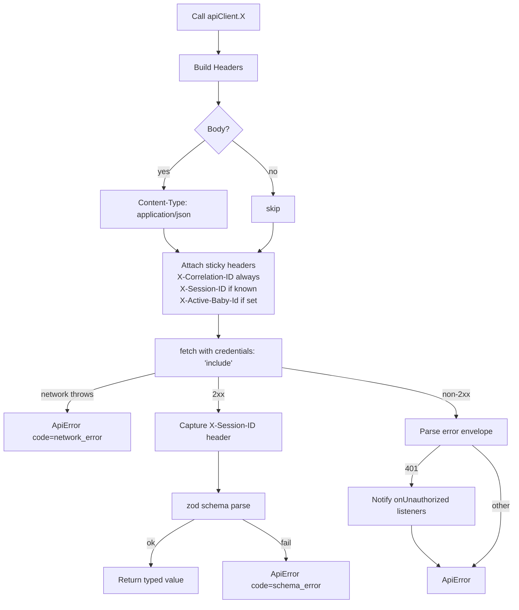
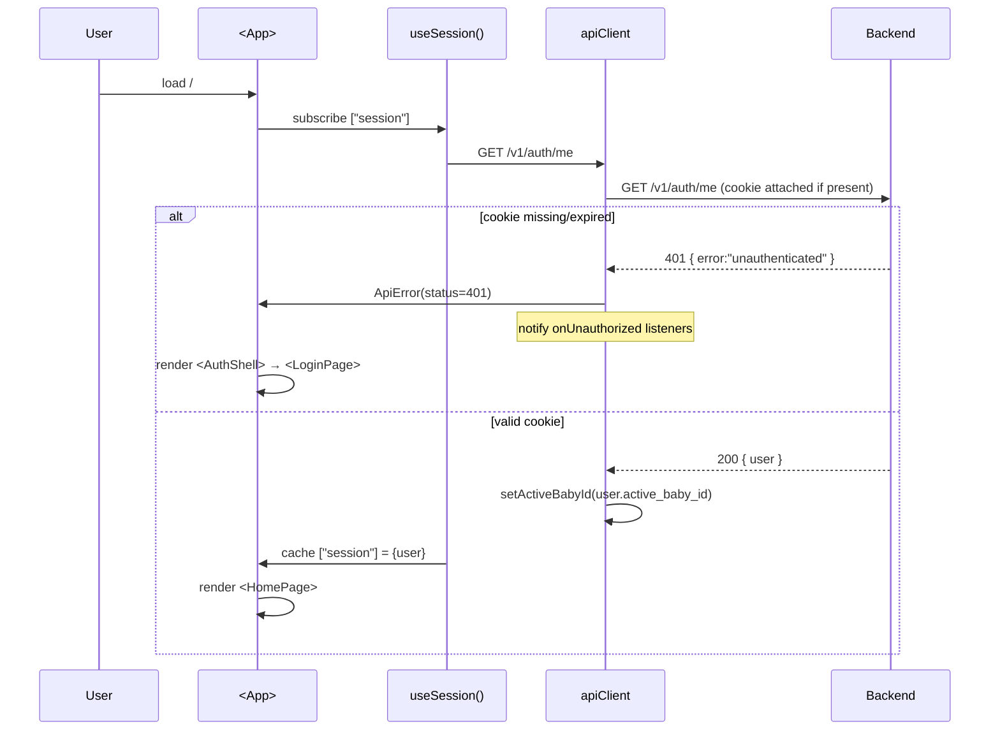
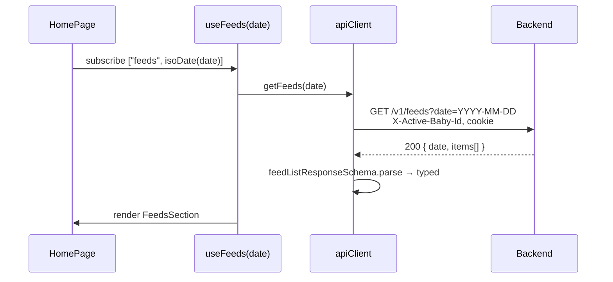
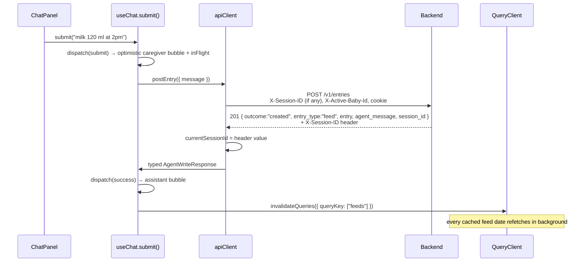

# MomDiary Frontend ↔ Backend Integration

> How the React + Vite frontend (`frontend/`) talks to the FastAPI backend (`backend/`). This document is the contract between the two halves of the app — read it before changing anything that crosses the wire.
>
> Companion to [backend/README-backend.md](../backend/README-backend.md). Where that doc explains the server, this one explains the **client side of the same protocol**.

---

## 1. TL;DR

- **Single base URL** controlled by `VITE_API_BASE_URL` (default `http://localhost:8000`).
- **Single fetch wrapper** — every request goes through [`apiClient.request()`](src/shared/apiClient.ts), which attaches headers, parses errors, validates responses with zod, and tracks the chat session id.
- **Single auth mechanism** — HttpOnly cookie set by `/v1/auth/*`. The client just sends `credentials: "include"` on every request; it never reads or writes the cookie itself.
- **Server-state-only** — all backend data lives in TanStack Query caches keyed by `["<resource>", isoDate]` or `["babies"]` / `["session"]`. There is no Redux/Zustand store for server data.
- **Three sticky headers** added by the client on every request: `X-Correlation-ID`, `X-Session-ID` (chat), `X-Active-Baby-Id` (tenant scope).
- **One typed surface** — `src/shared/types.ts` defines zod schemas for every wire shape. The TS types are inferred from the schemas, so wire drift becomes a compile error.

---

## 2. Configuration

| Setting | Where | Default | Purpose |
|---|---|---|---|
| `VITE_API_BASE_URL` | `frontend/.env` | `http://localhost:8000` | Origin of the FastAPI backend. Stripped of trailing `/`. |
| Dev server port | `vite.config.ts` | `5173` | Must match `MOMDIARY_ALLOWED_ORIGINS` on the backend (CORS + CSRF allow-list). |
| Cookie domain | (server) | host-only | The backend sets `momdiary_session` for the request's host. The frontend just relies on `credentials: "include"`. |

For local dev: backend listens on `8000`, frontend on `5173`. CORS, cookies, and CSRF all assume that pair.

---

## 3. The HTTP layer — `src/shared/apiClient.ts`

A thin, schema-validated wrapper over `fetch`. Everything the rest of the app uses goes through here.

### 3.1 The `request()` core



The implementation is short and worth reading directly: [src/shared/apiClient.ts](src/shared/apiClient.ts).

### 3.2 Headers the client sends

| Header | When | Source | Why |
|---|---|---|---|
| `Content-Type: application/json` | request has body | hard-coded | matches backend's Pydantic parsing |
| `X-Correlation-ID` | **every** request | `crypto.randomUUID()` (uuid4 fallback) | end-to-end tracing — server echoes back, logs bind to it |
| `X-Session-ID` | when known | module-level `currentSessionId`, set from first response | chat history continuity for `/v1/entries` |
| `X-Active-Baby-Id` | when known | module-level `activeBabyId`, set by `setActiveBabyId()` | per-request override for the active baby (multi-baby UX) |
| Cookie `momdiary_session` | always (browser-managed) | set by `/v1/auth/*` response | auth — HttpOnly, never readable from JS |

`fetch` is always called with `credentials: "include"` so the browser attaches `momdiary_session`. The Origin/Referer set by the browser is what the backend's `OriginCsrfMiddleware` validates against `MOMDIARY_ALLOWED_ORIGINS`.

### 3.3 Sticky chat session id

The first `POST /v1/entries` returns an `X-Session-ID` header. `request()` captures it into the module-level `currentSessionId`, and every subsequent request — including non-chat ones — replays it. The backend's `SessionStore` partitions by `(user_id, baby_id, session_id)`, so this id is the conversation handle.

Three places clear it:

1. `resetSessionId()` — explicit (rarely needed; exposed for tests).
2. `setActiveBabyId(newId)` when the id actually changes — switching baby starts a new conversation (research §R6).
3. Implicitly on `logout` because `queryClient.clear()` drops all cached state, and the next session id arrives from the next chat turn.

### 3.4 Sticky active-baby id

`useSession()` and the baby mutations call `setActiveBabyId(user.active_baby_id)` whenever the value changes. This mirrors `users.active_baby_id` into the request header so:

- The user can switch babies in the UI without a round-trip just to flip a server flag (the next mutation/list call carries the new id).
- The backend's `require_active_baby` dependency honours the header first, then the persisted column (research §R7).

### 3.5 Errors — `ApiError`

Every failure surfaces as one type:

```ts
class ApiError extends Error {
  status: number;          // HTTP status (or 0 for network errors)
  code: string;            // server's `error` field, or 'network_error' / 'schema_error' / 'http_error'
  correlationId: string;   // matches what backend logged
}
```

Server-side envelopes (`{error, message, correlation_id, ...}`) are decoded by `errorBodySchema`. If decoding fails we still throw an `ApiError` (with `code: "http_error"`) so callers never have to special-case shape.

`401` is special: in addition to throwing, the client calls every `onUnauthorized` listener. `useSession()` is the only subscriber today — it clears the `["session"]` cache and the active-baby header, which causes the app to render `LoginPage` on the next tick.

### 3.6 Response validation — zod

Every endpoint passes a zod schema (e.g. `feedListResponseSchema`, `agentWriteResponseSchema`) to `request()`. A schema mismatch is treated as a hard error (`code: "schema_error"`). This catches:

- accidental backend-side shape drift (e.g. a renamed field),
- buggy intermediate proxies that strip fields,
- envelope-vs-bare-object confusion.

TS types come from `z.infer<typeof schema>`, so the request/response types **cannot drift** from the validators.

---

## 4. State management — TanStack Query

Server state lives entirely in `@tanstack/react-query` (configured in [src/main.tsx](src/main.tsx) with `staleTime: 30s`, `retry: 1`, `refetchOnWindowFocus: false`). Mutations don't retry.

### 4.1 Query keys

Defined in [src/shared/queryKeys.ts](src/shared/queryKeys.ts).

| Key | Source of truth | Used by |
|---|---|---|
| `["session"]` | `GET /v1/auth/me` | `useSession`, login/register/logout mutations |
| `["babies"]` | `GET /v1/babies` | `useBabies`, profile page, baby switcher |
| `["feeds", "YYYY-MM-DD"]` | `GET /v1/feeds?date=…` | `useFeeds(date)` |
| `["sleeps", "YYYY-MM-DD"]` | `GET /v1/sleeps?date=…` | `useSleeps(date)` |
| `["poops", "YYYY-MM-DD"]` | `GET /v1/poops?date=…` | `usePoops(date)` |
| `["appointments", "YYYY-MM-DD"]` | `GET /v1/appointments?date=…` | `useAppointments(date)` |

All diary keys use `format(date, "yyyy-MM-dd")` as their second segment so the cache is canonical regardless of `Date` object identity.

### 4.2 Invalidation rules

| Trigger | Invalidates |
|---|---|
| `useLoginMutation.onSuccess` / `useRegisterMutation.onSuccess` | `setQueryData(["session"], data)` (skip refetch) |
| `useLogoutMutation.onSuccess` | `queryClient.clear()` — drop everything |
| `useUpdateProfileMutation.onSuccess` | `setQueryData(["session"], data)` |
| `useCreateBabyMutation.onSuccess` | `["babies"]` + `["session"]` (server may auto-activate) |
| `useUpdateBabyMutation.onSuccess` | `["babies"]` |
| `useDeleteBabyMutation.onSuccess` | `["babies"]` + `["session"]` (server may reassign active baby — FR-017) |
| `useSetActiveBabyMutation.onSuccess` | `["session"]` **and** every diary key (`feeds`/`sleeps`/`poops`/`appointments`) — diary lists are baby-scoped server-side |
| Chat `submit` (success, write outcome) | `[<section>]` — entire section family, **not** the specific date, because the entry's `occurred_at` may not match the selected date |
| Quick-log mutations (`createFeed`, etc.) | corresponding date key |

The chat-driven invalidation deserves emphasis: when the agent logs a feed for "yesterday at 9pm" while the user is viewing today, a date-scoped invalidation would silently miss. `qc.invalidateQueries({ queryKey: ["feeds"] })` instead refetches every cached feeds date.

### 4.3 Hooks per feature

| Feature | Hook(s) | File |
|---|---|---|
| Session/auth | `useSession`, `useLoginMutation`, `useRegisterMutation`, `useLogoutMutation`, `useUpdateProfileMutation` | [src/features/auth/useSession.ts](src/features/auth/useSession.ts) |
| Babies | `useBabies`, `useCreateBabyMutation`, `useUpdateBabyMutation`, `useDeleteBabyMutation`, `useSetActiveBabyMutation` | [src/features/babies/useBabies.ts](src/features/babies/useBabies.ts) |
| Diary lists | `useFeeds`, `useSleeps`, `usePoops`, `useAppointments` | `src/features/<section>/use<Section>.ts` |
| Chat | `useChat` (`useReducer` + two mutations) | [src/features/chat/useChat.ts](src/features/chat/useChat.ts) |

---

## 5. End-to-end flows

### 5.1 Boot — first paint after `npm run dev`



### 5.2 Login

`LoginPage` calls `useLoginMutation().mutate({email, password})`. On success:

1. Backend sets `momdiary_session` cookie.
2. Client mirrors `active_baby_id` into the header state.
3. `setQueryData(["session"], {user})` — `useSession()` re-renders synchronously, no refetch.

If the user already had no `active_baby_id`, `<HomePage>` shows `<FirstBabyPrompt>` which calls `useCreateBabyMutation`.

### 5.3 Listing a day's diary



### 5.4 Chat write — `POST /v1/entries`



Clarification turns are identical except the response is `{outcome:"clarification_requested", agent_message, suggested_candidates?}` (still HTTP 200). The reducer only suppresses cache invalidation for non-write outcomes.

Errors (network, schema, 4xx/5xx) all funnel into the same reducer path, which:

- preserves the caregiver's draft (`preservedDraft`) so they don't lose typing,
- renders a friendly assistant bubble with the `correlation_id` for support, and
- exposes `error.code` / `error.message` on the message for a "show details" affordance.

### 5.5 Switching baby

`BabySwitcher` calls `useSetActiveBabyMutation(baby_id)`:

1. `POST /v1/users/me/active-baby` — server persists.
2. `setActiveBabyId(user.active_baby_id)` — header mirror updates.
3. **Inside `setActiveBabyId`**, the chat session id is cleared because changing baby == new conversation.
4. `invalidateQueries({ predicate })` evicts every diary key — the next render refetches with the new `X-Active-Baby-Id`.

### 5.6 Deleting a baby (profile page)

`useDeleteBabyMutation.mutate(id)` →
1. `DELETE /v1/babies/{id}` (soft-delete).
2. Backend may reassign `users.active_baby_id` to the newest remaining baby (FR-017) or `NULL`.
3. Client invalidates `["babies"]` + `["session"]`. The refetched session carries the new `active_baby_id`, `useSession` mirrors it into the header, and downstream queries (still subscribed via TanStack) refire automatically with the new scope.

---

## 6. Wire-shape reference

This table shows where each backend route is consumed. **Add a new endpoint** by registering it on `apiClient`, defining its zod schema in `types.ts`, and exporting a hook from the relevant `features/*` folder.

| Backend route | Client method | Schema | Primary consumer |
|---|---|---|---|
| `POST /v1/auth/register` | `apiClient.register` | `authMeSchema` | `useRegisterMutation` → `SignupPage` |
| `POST /v1/auth/login` | `apiClient.login` | `authMeSchema` | `useLoginMutation` → `LoginPage` |
| `POST /v1/auth/logout` | `apiClient.logout` | `okResponseSchema` | `useLogoutMutation` → header menu |
| `GET /v1/auth/me` | `apiClient.me` | `authMeSchema` | `useSession` |
| `PATCH /v1/users/me` | `apiClient.updateMe` | `authMeSchema` | `useUpdateProfileMutation` → `ProfilePage` |
| `POST /v1/users/me/active-baby` | `apiClient.setActiveBaby` | `authMeSchema` | `useSetActiveBabyMutation` → `BabySwitcher` |
| `GET /v1/babies` | `apiClient.listBabies` | `babyListResponseSchema` | `useBabies` → `ProfilePage`, `BabySwitcher` |
| `POST /v1/babies` | `apiClient.createBaby` | `babySchema` | `useCreateBabyMutation` → `FirstBabyPrompt`, `ProfilePage` |
| `PATCH /v1/babies/{id}` | `apiClient.updateBaby` | `babySchema` | `useUpdateBabyMutation` → `BabyCard` |
| `DELETE /v1/babies/{id}` | `apiClient.deleteBaby` | `okResponseSchema` | `useDeleteBabyMutation` → `RemoveBabyDialog` |
| `GET /v1/feeds?date=` | `apiClient.getFeeds` | `feedListResponseSchema` | `useFeeds` → `FeedsSection` |
| `POST /v1/feeds` | `apiClient.createFeed` | `feedEntrySchema` | quick-log button |
| `PATCH /v1/feeds/{id}` | `apiClient.updateFeed` | `feedEntrySchema` | `EntryActions` (edit) |
| `DELETE /v1/feeds/{id}` | `apiClient.deleteFeed` | `voidSchema` (204) | `EntryActions` (delete) |
| *(same for sleeps / poops / appointments)* | … | … | per-section components |
| `POST /v1/appointments/{id}/notes` | `apiClient.addAppointmentNote` | `appointmentNoteSchema` | appointment detail |
| `POST /v1/entries` | `apiClient.postEntry` | `agentWriteResponseSchema` | `useChat.submit` (diary mode) |
| `PUT /v1/entries` | `apiClient.putEntry` | `agentWriteResponseSchema` | `EntryActions` → agent-mediated edits |
| `POST /v1/research` | `apiClient.postResearch` | `researchResponseSchema` | `useChat.submit` (research mode) |

The complete client surface is in [src/shared/apiClient.ts](src/shared/apiClient.ts).

---

## 7. Testing

### 7.1 MSW handlers

All component and hook tests run against [Mock Service Worker](https://mswjs.io/) handlers in `frontend/tests/_msw/`. They mimic the backend's envelope precisely — including `X-Session-ID` response headers and `errorBodySchema`-shaped error bodies — so the same `apiClient` runs in both dev and tests.

When you add a backend route, also add an MSW handler in `tests/_msw/handlers.ts` so tests don't accidentally make real network calls.

### 7.2 What to test where

| Test type | Folder | Example |
|---|---|---|
| Unit (pure logic) | `frontend/src/**/*.test.ts(x)` next to source | `chat/reducer.test.ts` |
| Hook | `frontend/tests/hooks/` | `useFeeds` cache key + invalidation |
| Integration (component + MSW) | `frontend/tests/integration/` | `profile-page.test.tsx` — full ProfilePage with mocked babies + session |

Run:

```powershell
cd frontend
npm run test           # vitest watch
npm run test -- --run  # single run
npm run typecheck      # tsc --noEmit
npm run lint           # biome
```

Coverage gate (matching the backend's Principle II): **80 % lines / 70 % branches / 80 % statements / 80 % functions** (enforced in `vite.config.ts`).

---

## 8. Operational notes

### 8.1 Authentication failure → redirect

Any `401` triggers every registered `onUnauthorized` listener. `useSession()` subscribes once at app mount and:
1. clears `["session"]` cache (forces `null`),
2. clears `activeBabyId`.

The next render sees `data === null` and `AuthShell` shows `LoginPage`. No imperative router calls are needed.

### 8.2 Correlation IDs everywhere

Every `ApiError` carries `correlationId`. The chat UI surfaces it on assistant error bubbles so a user can paste it into a bug report; ops can grep backend logs for the same id.

### 8.3 Active-baby header vs. server-persisted value

The header is an **override**, not a replacement. The server uses the header first and falls back to `users.active_baby_id`. The frontend treats the header as a cached mirror of the persisted value — they should never disagree for long, and they only diverge during the brief window between firing `useSetActiveBabyMutation` and its `onSuccess`.

### 8.4 What does *not* live in TanStack Query

| State | Lives in | Notes |
|---|---|---|
| Currently selected date | `useState` in `HomePage` | non-server state |
| Chat messages | `useReducer` in `useChat` | session-scoped; intentionally not persisted |
| Composer draft | same | survives error to avoid losing typed text |
| Profile sub-views (edit, remove dialog) | `useState` in `ProfilePage` | pure UI |

### 8.5 CORS & cookie pitfalls (dev)

If you change the dev origin or port, you must also update:

1. `frontend/.env` → `VITE_API_BASE_URL` (if the backend port changes).
2. `backend/.env` → `MOMDIARY_ALLOWED_ORIGINS` (must include the frontend origin).
3. `MOMDIARY_SESSION_COOKIE_SAMESITE` — `lax` works for same-site; pick `none` only when serving over HTTPS with `SECURE=true`.
4. Browsers will silently drop the cookie if **either** CORS misconfiguration or the `Secure` flag mismatches HTTPS — open DevTools → Application → Cookies to debug.

### 8.6 Adding an endpoint — client-side checklist

1. **Schema** — add `<thing>Schema` + `type <Thing> = z.infer<...>` to `src/shared/types.ts`.
2. **Client method** — add to `apiClient` in `src/shared/apiClient.ts`, passing the schema.
3. **Hook** — add a TanStack hook in the appropriate `features/<area>/use<Area>.ts`. Pick the right query key and document its invalidation neighbours.
4. **MSW** — add the handler in `tests/_msw/handlers.ts` so tests stay deterministic.
5. **Test** — colocate a unit test for the hook + a component integration test that covers happy/error paths.

---

## 9. Related references

- [backend/README-backend.md](../backend/README-backend.md) — server-side counterpart to this document.
- `backend/docs/openapi.yaml` — source of truth for wire shapes; every zod schema in this codebase mirrors a section of it.
- `frontend/README.md` — broader frontend setup, project structure, build/deploy.
- `specs/00{1..7}-*` — per-feature specs that drove the current API surface; consult these when extending a flow.
