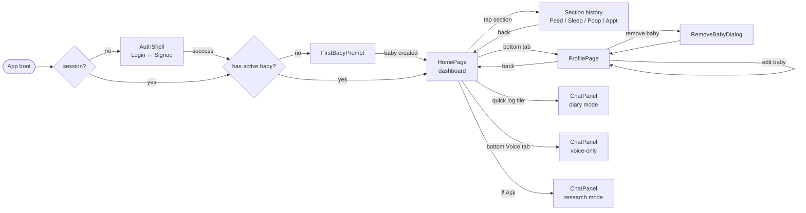
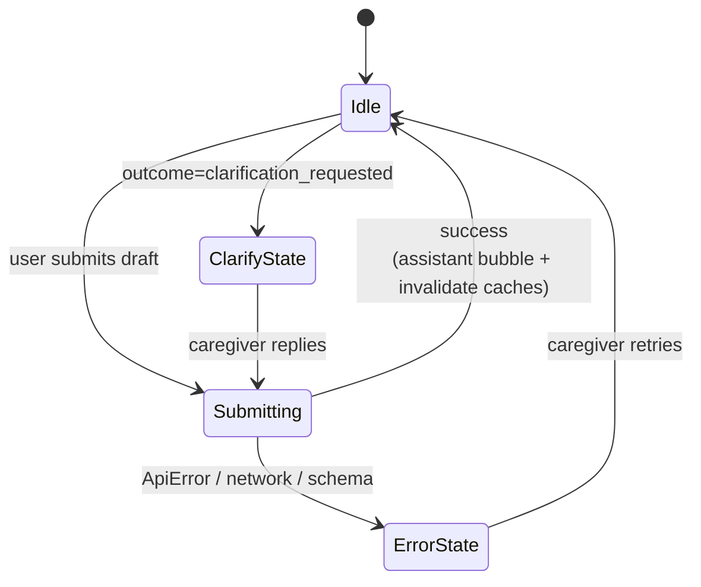
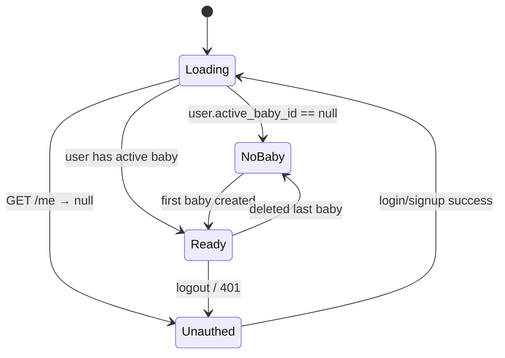
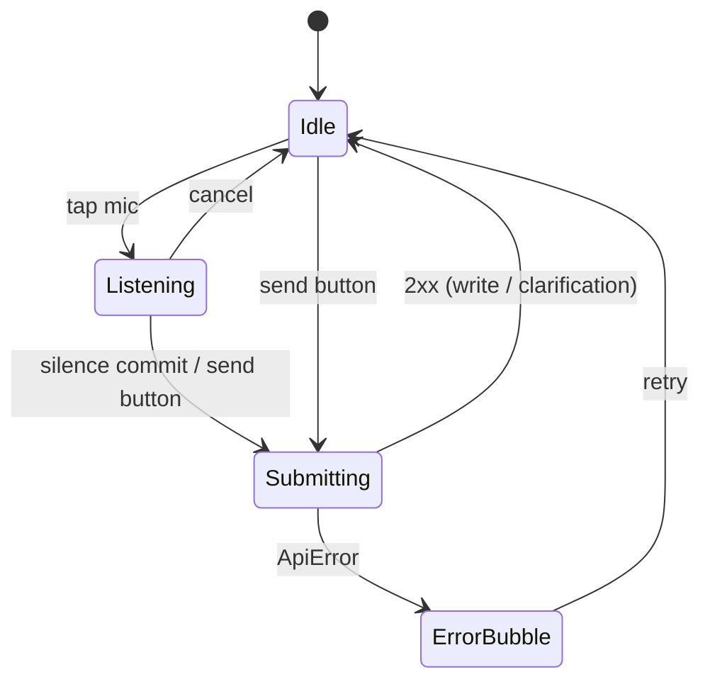
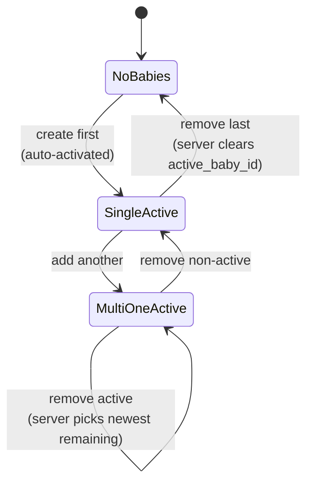

# MomDiary UX Workflows

> How the UI is structured, which screens exist, what every interaction does, and the design rules each flow follows. This is the **user-facing** counterpart to [README-integration.md](README-integration.md) (which explains the wire protocol) and [../backend/README-backend.md](../backend/README-backend.md) (which explains the server).
>
> Audience: designers, PMs, and engineers about to touch a screen.

---

## 1. Product principles

The whole app is built around four constraints. Every flow below is a direct consequence of one or more of these:

1. **Hands-busy, eyes-half-on-the-baby.** A caregiver can be holding a baby. Most logging happens by voice or by tapping one large tile, not by filling forms.
2. **Forgiving conversation, not validation.** When inputs are ambiguous, the agent asks; it never silently guesses or rejects with a 400. Free-form text always works.
3. **One baby at a time, always scoped.** Everything the user sees — dashboard, history, chat — is for the currently active baby. Switching baby starts a clean conversation thread.
4. **Reversible-by-default, destructive-when-asked.** Soft-deletes are the norm; baby removal is an explicit, plainly-worded confirmation. The app never auto-submits a destructive action.

---

## 2. Screen map



There is **no client-side router** in v1. Top-level navigation is a `view` enum in [App.tsx](src/App.tsx); modals (`ChatPanel`, `RemoveBabyDialog`, `AddBabyDialog`) are rendered above the current view. The decision is documented inline: "the app is currently a single-pane mobile flow and adding react-router for one drill-down would be over-engineering."

---

## 3. First-run / onboarding

| Step | Screen | Action | Outcome |
|---|---|---|---|
| 1 | `AuthShell → SignupPage` | Email + password + display name | Account created, 30-day cookie issued, redirect to step 2 |
| 2 | `FirstBabyPrompt` | Name + DOB + optional color tag | First baby created and **auto-activated** server-side; redirect to step 3 |
| 3 | `HomePage` | Empty dashboard, "No feed yet" stats | Caregiver taps a quick-log tile or `+ Ask` to record their first event |

Design notes:
- The signup → login toggle is a single component (`AuthShell`) with local state — no extra route.
- `FirstBabyPrompt` is **modal in concept**: until `users.active_baby_id` is set, the user cannot reach the dashboard. The backend enforces this with `409 no_active_baby`; the client mirrors the rule by rendering the prompt whenever `active_baby_id == null` (see [AuthGate](src/App.tsx)).
- Sign-in identifier (email) is intentionally **not editable** in v1 (FR-008). The caregiver card on the Profile page shows it read-only.

---

## 4. Home dashboard (`HomePage`)

The dashboard is the app's "you are here." It's a single mobile-width column ([HomePage.tsx](src/features/home/HomePage.tsx)):

```
┌─────────────────────────────────┐
│ Baby switcher  ·  Sign-out      │   ← thin utility strip
├─────────────────────────────────┤
│ Good morning                    │
│ Baby Lucy                       │   ← greeting + baby name + 🔔
├─────────────────────────────────┤
│ Last feed │ Sleep today │ Next  │   ← stats card (3-up)
│   2h ago  │   3h 20m    │ Tue   │
├─────────────────────────────────┤
│ [Feed][Sleep][Poop][Appt][More] │   ← quick-log grid
├─────────────────────────────────┤
│ Recent logs                     │
│  • Feed — 120 ml breast milk    │
│  • Sleep — 1h 10m nap           │   ← chronological list
│  ⋮                              │
├─────────────────────────────────┤
│ [Home] [Voice] [Ask] [Profile]  │   ← bottom tab bar
└─────────────────────────────────┘
```

### 4.1 Stats card

| Field | Source | Empty state |
|---|---|---|
| **Last feed** | `feeds.items` sorted by `occurred_at`, `.at(-1)` formatted as "Xh ago" | "—" / "No feed yet" |
| **Sleep today** | `Σ sleeps.items[].duration_minutes` formatted as `Xh Ym` | "0m" / "0 naps" |
| **Next appt** | `appointments.items` filtered to future, earliest first | "—" / "None scheduled" |

All three live-update when the chat agent logs an entry — `useChat.submit` invalidates the entire section family.

### 4.2 Quick-log grid

Five tiles: Feed, Sleep, Poop, Appt, More. Tapping one **does not open a form** — it dispatches a templated natural-language message into the chat panel:

| Tile | Templated message → `useChatContext().submit(...)` |
|---|---|
| Feed | `"Log a feed right now."` |
| Sleep | `"Log a sleep ending right now."` |
| Poop | `"Log a diaper right now."` |
| Appt | `"Schedule an appointment."` |

The chat panel opens (`onOpenChat`), the agent receives the templated message, and either:
- has enough context → creates the entry, dashboard refetches, the assistant bubble confirms; or
- needs more → returns `clarification_requested` and the caregiver answers in plain text.

This is why there are no `<form>` modals for quick-log: the agent loop is the form.

The fifth tile, **More**, is a router into the four history pages (`onOpenFeedHistory`, etc.) — a deliberate scope-cap so the home grid never grows beyond a 2×3 reachable thumbprint.

### 4.3 Recent logs

A unified, chronologically reverse-ordered list across all four sections for the currently selected date. Each row is read-only on Home (`EntryActions` lives on the section history pages where you have room to edit/delete).

### 4.4 Bottom tab bar

| Tab | Behavior |
|---|---|
| **Home** | Already here (no-op) |
| **Voice** | Opens `ChatPanel` with `voiceOnly={true}` — mic auto-starts, no textarea, research mode |
| **Ask** | Opens `ChatPanel` in normal diary mode |
| **Profile** | Switches `view` to `"profile"` |

`Voice` is its own tab (not just a button inside Chat) because **the mic must start within the click's user-gesture window**. Chrome refuses `SpeechRecognition.start()` outside a gesture, and a dynamic `import()` of `ChatPanel` resolves after the click tick. Solution: the app proactively `import()`'s `ChatPanel` on mount ([App.tsx](src/App.tsx)) so the chunk is warm, and the tab handler synchronously sets `chatVoiceOnly=true` + `chatVisible=true`.

---

## 5. Chat — the conversational logging surface

The chat panel ([ChatPanel.tsx](src/features/chat/ChatPanel.tsx)) is the heart of the app. It's a bottom-anchored modal that overlays whatever view you're on. **All entry mutations originating from the user funnel through here**, even the quick-log tiles (§4.2) and the edit buttons in history (§7.3).

### 5.1 Two modes

| Mode | Endpoint | Trigger |
|---|---|---|
| **Diary** | `POST /v1/entries` | Default — `Ask` tab, quick-log tiles, edit-this-entry |
| **Research** | `POST /v1/research` | `Voice` tab (voice-only), explicit mode toggle inside the panel |

Mode is the only thing that changes the network call — the UI shell is identical.

### 5.2 Message lifecycle (`useChat`)



States from [reducer.ts](src/features/chat/reducer.ts):
- `submit` — append caregiver bubble, clear draft, set `inFlight=true`.
- `success` — append assistant bubble, clear draft, `inFlight=false`.
- `error` — append assistant bubble (friendly text + correlation ID), **restore draft** so typing isn't lost, `inFlight=false`.
- Message history is capped at `CHAT_HISTORY_LIMIT` (FIFO) to keep the panel scrollable but bounded.

### 5.3 Voice input (Web Speech)

[ChatPanel.tsx](src/features/chat/ChatPanel.tsx) ships an inline `useSpeechRecognition` hook over `window.SpeechRecognition` / `webkitSpeechRecognition`. Key rules:

- **Continuous mode + silence-based commit.** The recognizer stays open through inter-word pauses; an 1800 ms silence timer commits the utterance and submits.
- **Auto-restart on `onend`.** Some browsers force-end the recognizer mid-utterance; the hook transparently restarts and preserves the accumulated transcript.
- **Cancel pill.** While listening, a single tap aborts without submitting.
- **Voice-only tab** hides the textarea entirely and disables mode switching — every utterance goes to research.
- **Firefox** has no Web Speech API; the mic button is hidden when `supported === false`.

### 5.4 Conversation continuity

The first turn returns `X-Session-ID`; every subsequent client request replays it so the backend's bounded in-memory `SessionStore` threads history into the prompt. Two things reset it:

1. Switching baby (`setActiveBabyId(new)` clears the cached session id).
2. Logging out (`queryClient.clear()` and the next chat seeds a new id).

The caregiver doesn't see session ids — they just experience "the agent remembers what we just talked about, but switching to my other baby is a clean slate."

### 5.5 Error UX

A failed turn shows a single assistant bubble with:
- a friendly sentence ("Something went wrong saving that — please try again."),
- the `correlation_id` for support, and
- `error.code` / `error.message` revealed behind a "details" affordance.

The draft is **preserved**. No toast, no auto-retry — the caregiver decides what happens next.

---

## 6. Multi-baby UX

### 6.1 Baby switcher (top strip)

A compact `<select>` of every owned, non-deleted baby plus a ⚙ Manage button ([BabySwitcher.tsx](src/features/babies/BabySwitcher.tsx)).

| Action | Wire effect |
|---|---|
| Change selection | `POST /v1/users/me/active-baby`; mirror `X-Active-Baby-Id` header; reset chat session id; invalidate every diary key |
| Click ⚙ | Open a small inline panel to quick-add or delete (full management is in Profile) |

The switcher is intentionally always-visible (above Home and Profile both) so the active scope is never ambiguous.

### 6.2 Active-baby invariants

| Invariant | Where enforced |
|---|---|
| Diary lists/writes are always for exactly one baby | Server: `require_active_baby` + ContextVar; Client: `X-Active-Baby-Id` header sticky in `apiClient` |
| `users.active_baby_id` is `NULL` only when the user has **no** non-deleted babies | Server: `BabyService.soft_delete` FR-017 fallback |
| Switching baby starts a fresh chat thread | Client: `setActiveBabyId()` clears `currentSessionId` |
| Editing a non-active baby does not change which baby is active | Client: `useUpdateBabyMutation` only touches `["babies"]`, not `["session"]` |

---

## 7. Profile (`ProfilePage`)

Reached via the `Profile` bottom tab. One screen, three concerns ([ProfilePage.tsx](src/features/profile/ProfilePage.tsx)):

```
┌─────────────────────────────────┐
│ ← Back              Profile     │
├─────────────────────────────────┤
│ YOUR DETAILS              [Edit]│
│ Display name: Sarah             │   ← CaregiverCard
│ Email:        sarah@example.com │   ← read-only
├─────────────────────────────────┤
│ YOUR BABIES        [Add a baby] │
│ ┌─────────────────────────────┐ │
│ │ Lucy · 4 months old   ACTIVE│ │   ← BabyCard
│ │ [Edit] [Remove]             │ │
│ └─────────────────────────────┘ │
│ ⋮                               │
└─────────────────────────────────┘
```

### 7.1 Edit caregiver (`CaregiverCard`)

- Edit button reveals an inline form with the display name field only.
- Validation: 1..80 chars after trim. Anything else short-circuits client-side with `clientError`.
- Submit → `PATCH /v1/users/me` → on success, exit edit mode; on `ApiError`, render the server's message.
- Email is shown but not editable (FR-008).

### 7.2 Edit baby (`BabyCard`)

- Edit button reveals inline form with display name + date of birth.
- Validation: 1..80 chars; DOB is `YYYY-MM-DD` and cannot be in the future.
- Submit → `PATCH /v1/babies/{id}`.
- **Editing the non-active baby does not switch the active baby** (FR-013). The UI doesn't show an "activate" button on the card; the only way to activate is the top-strip switcher.

### 7.3 Remove baby (`RemoveBabyDialog`)

The single destructive flow in the app, deliberately friction-heavy ([RemoveBabyDialog.tsx](src/features/profile/RemoveBabyDialog.tsx)):

1. User taps **Remove** on a baby card → dialog opens.
2. Dialog plainly names the consequence by the baby's name: "This will hide Lucy's profile and all of Lucy's feeds, sleeps, diapers, and appointments from every view. You won't be able to undo this from the app."
3. Focus lands on the **Cancel** button (the safe option). Esc cancels. Backdrop click cancels.
4. **Enter does not auto-submit** — the user must deliberately click Remove. (Research §R4.)
5. While `del.isPending`, both buttons disable.
6. On success: server soft-deletes; if it was the active baby, server atomically reassigns to the newest remaining baby (FR-017). Client refetches `["babies"]` + `["session"]`. Dialog closes.
7. If that was the user's **only** baby: `active_baby_id` becomes `NULL` server-side; the next render returns the user to `FirstBabyPrompt`.

### 7.4 Add baby (`AddBabyDialog`)

A lighter sibling of `FirstBabyPrompt` reachable from inside Profile. Name + DOB. Future DOB rejected client-side. On success, dialog closes and the new baby appears in the list. Backend auto-activates only if the user previously had **no** babies.

---

## 8. Section history pages

Four parallel pages, one per resource ([src/features/home/](src/features/home)): `FeedHistoryPage`, `SleepHistoryPage`, `PoopHistoryPage`, `AppointmentHistoryPage`. They share the same layout:

```
┌─────────────────────────────────┐
│ ← Back            Feeds         │
│ < Sat, May 23 >  📅             │   ← DateBar
├─────────────────────────────────┤
│ 9:42 am · 120 ml breast milk    │
│   [Edit] [Delete]               │
│ 6:15 am · 90 ml formula         │
│   [Edit] [Delete]               │
│ ⋮                               │
└─────────────────────────────────┘
```

### 8.1 Date selection (`DateBar`)

[DateBar.tsx](src/features/date/DateBar.tsx) provides `‹ today ›` arrows and a native `<input type="date">` picker. Each change:
- updates `useSelectedDate()` context;
- invalidates `["feeds"|"sleeps"|"poops"|"appointments", isoDate(next)]` so the new day's data refetches.

The selected date is **app-global** (`SelectedDateProvider` at the root) — switching pages preserves it.

### 8.2 Edit / delete per row (`EntryActions`)

Each row has `Edit` and `Delete` actions ([shared/EntryActions.tsx](src/shared/EntryActions.tsx)). Behavior:

- **Edit** opens the chat panel and pre-fills a templated message ("Update this feed: 10:00 am 120 ml breast milk → …"). The agent then completes the edit via `PUT /v1/entries` (direct branch — backend bypasses the LLM when `entry_id` + `entry_type` are supplied, see backend §6.5).
- **Delete** calls the corresponding per-entry `DELETE /v1/{resource}/{id}` directly (no chat round-trip — the action is unambiguous and the row is right there).

Soft-deletes do not animate the row out; the table is just refetched and the row disappears, matching the rest of the app's "no jank" stance.

---

## 9. Cross-cutting UX rules

### 9.1 Loading & error skeletons

- TanStack Query gives every hook `isLoading`, `isFetching`, `isError`, `refetch`. Standard pattern:
  ```tsx
  if (q.isLoading) return <Skeleton />;
  if (q.isError)   return <ErrorWithRetry onRetry={q.refetch} />;
  return <Content data={q.data} />;
  ```
- Top-of-app `AuthGate` shows a centered "Loading…" while `useSession` is in-flight — never the empty Home, never a flash of `<LoginPage>`.

### 9.2 Optimistic updates

Currently used in exactly one place: the chat reducer appends the caregiver's bubble **before** the network responds, so the conversation feels instant. We deliberately **do not** optimistically insert diary rows — the agent may rewrite the timestamp, decide to update an existing entry, or ask for clarification, so a premature row in the list would be wrong half the time.

### 9.3 Accessibility

| Rule | Implementation |
|---|---|
| All dialogs are `role="dialog" aria-modal="true"` with `aria-labelledby` / `aria-describedby` | `RemoveBabyDialog`, `AddBabyDialog`, `ChatPanel` |
| Destructive dialogs focus the safe option | `cancelRef.current?.focus()` on mount |
| Esc closes dialogs (when not in flight) | `keydown` listener inside the dialog |
| Stats / lists have `aria-label` | `<section aria-label="Today at a glance">`, etc. |
| Errors are announced | `role="alert" aria-live="polite"` on every error `<p>` |
| Touch targets ≥ 44 × 44 | Tailwind sizes audited per tile / button |

### 9.4 Mobile-first sizing

Every container uses `mx-auto max-w-md` (≤ 28 rem). The layout works without changes from 320 px (iPhone SE) up. Desktop just becomes a centered column on an amber-50 page.

### 9.5 Iconography

Custom playful SVGs in [shared/playfulIcons.tsx](src/shared/playfulIcons.tsx) for the four diary sections (`FeedFunIcon`, `SleepFunIcon`, `PoopFunIcon`, `AppointmentFunIcon`). Heroicons are used for utility chrome (bell, gear, chevrons). No icon font.

### 9.6 Persistence beyond the cookie

| State | Persisted? |
|---|---|
| Session cookie | Yes (HttpOnly, 30 days rolling, server-managed) |
| Chat-visible toggle | Yes (`localStorage`) |
| Selected date | No (resets to today on reload) |
| Chat messages | No (in-memory `useReducer`; agent-side memory in the backend's `SessionStore`) |
| Composer draft | No across reloads; preserved across in-session errors |

---

## 10. State machines worth keeping in your head

### 10.1 App-level



### 10.2 Chat turn



### 10.3 Baby lifecycle (UX-visible)



---

## 11. Open UX debts (tracked elsewhere)

- **Research mode citations**: the backend stub returns three static URLs. The UI is wired but the answers aren't real yet.
- **Notifications**: the bell icon on Home is decorative; no notification surface exists yet.
- **Multi-caregiver sharing**: every baby is single-owner in v1 (FR-019). Invitations are deferred to a later feature.
- **Undo for removal**: there is none from the app. Soft-delete recovery requires a DB-side restore.

---

## 12. Related references

- [README-integration.md](README-integration.md) — wire protocol, hooks, query keys.
- [../backend/README-backend.md](../backend/README-backend.md) — API surface and server design.
- `specs/00{1..7}-*` — per-feature specs that drove these UX rules; the `quickstart.md` inside each spec is a click-through script of the intended flow.
- `specs/007-profile-management/spec.md` — most recent UX-heavy spec (Profile screen, FR-009..FR-018).
